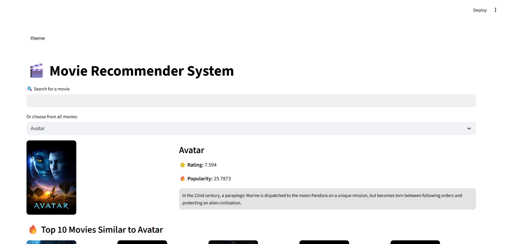

# 🎬 Movie Recommender System

A Streamlit app that recommends movies based on your selection using content-based filtering. 
It fetches movie posters and details dynamically from TMDB API and shows top similar movies.

## Features
- Search movies with autocomplete
- View movie poster, rating, popularity, and overview
- Get top 10 similar movie recommendations
- Dynamic theme switching (Light / Dark)

  
## Installation

1. Clone the repo:
   git clone https://github.com/sivasakthiek/movie-recommendation-system.git
2. Install dependencies:
   pip install -r requirements.txt
3. Run the app:
   streamlit run app.py

## Live Demo
[Streamlit App Link](https://mini-movie-recommendation-system.streamlit.app/)

## Tech Stack
- Python, Pandas, Requests
- Streamlit for UI
- TMDB API for movie data
- Google Drive for storing pickle files

